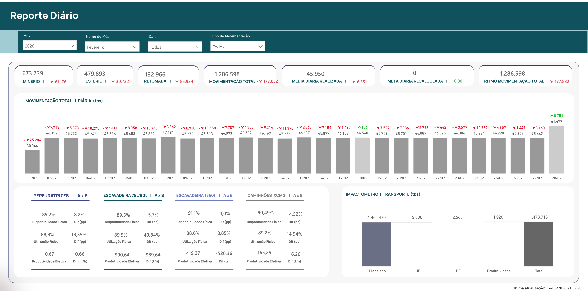
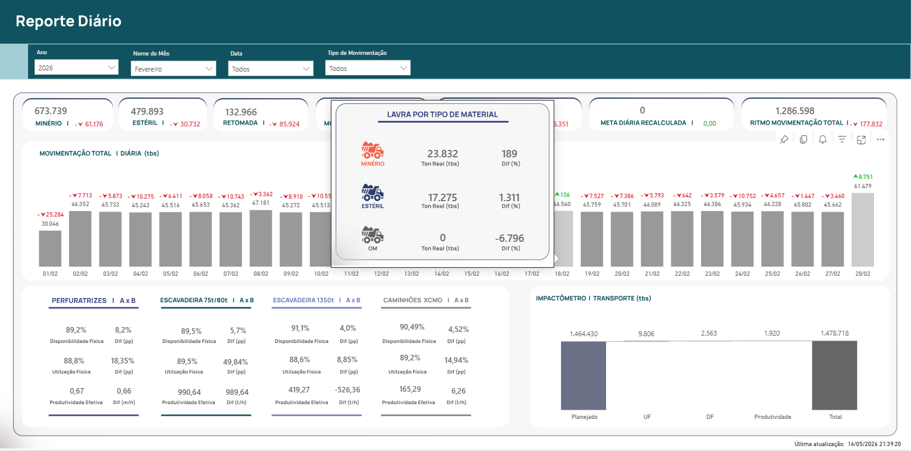
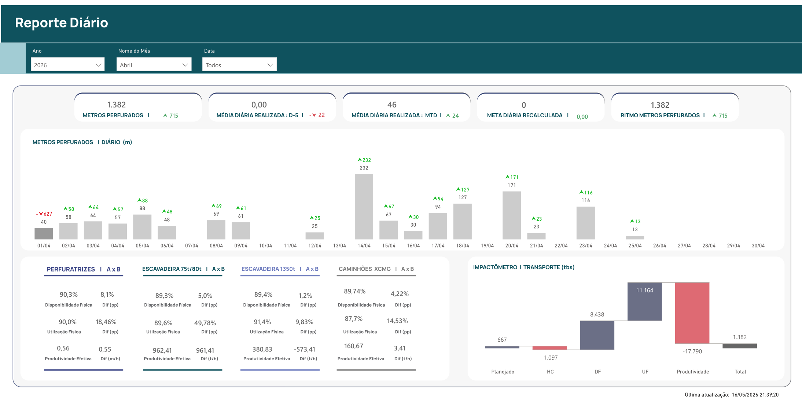
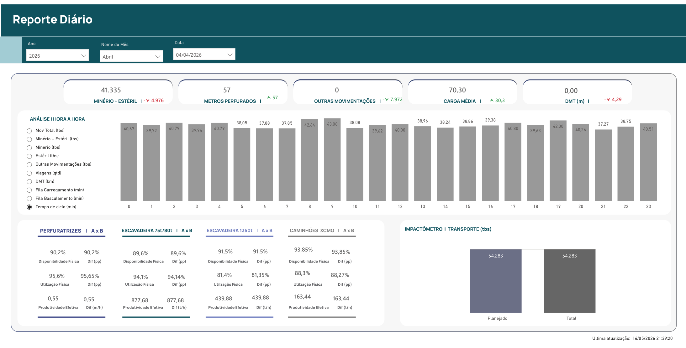
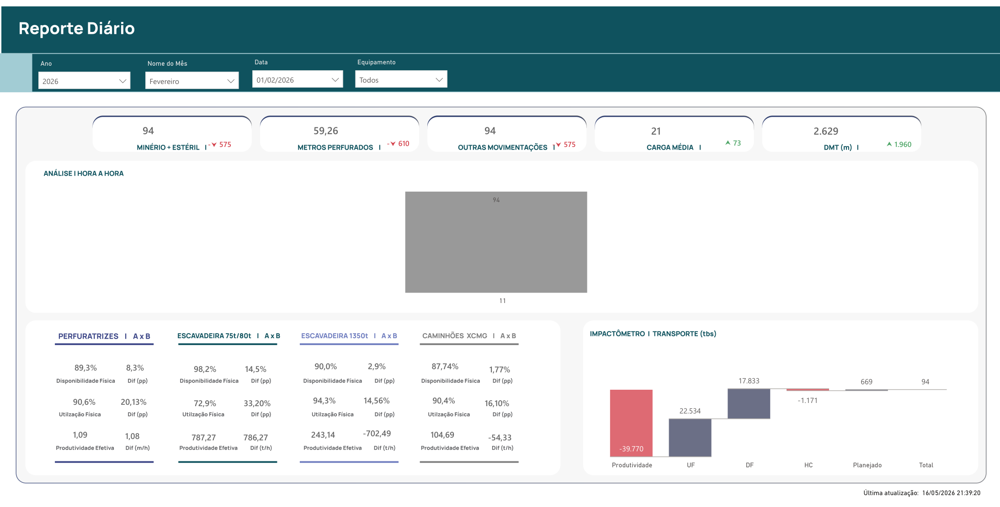
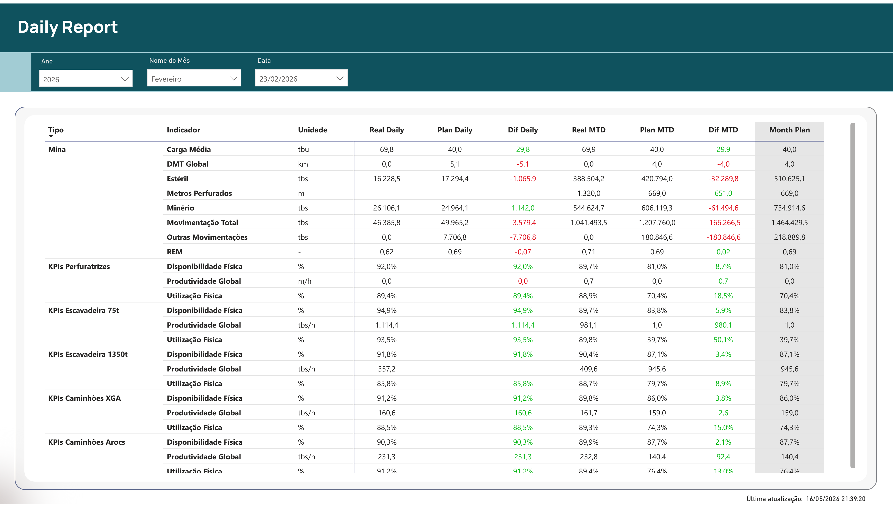
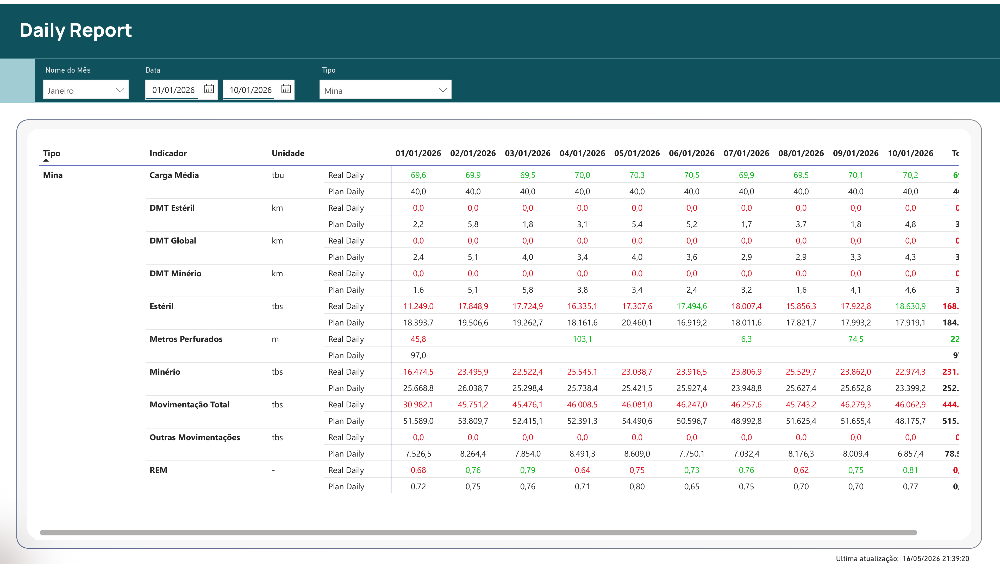
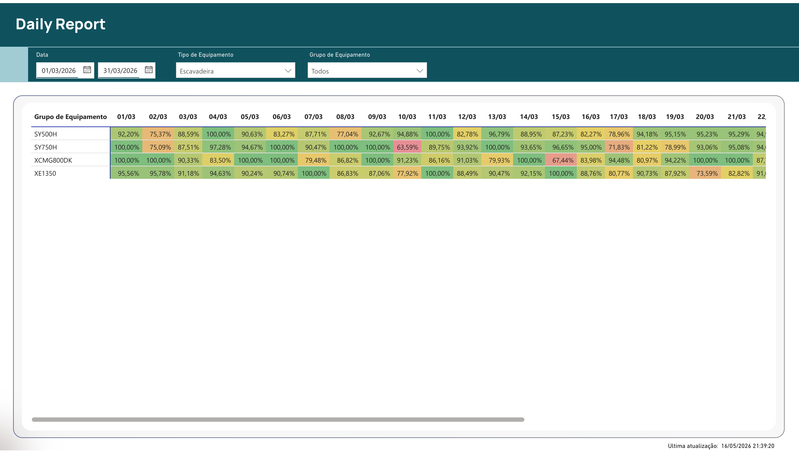
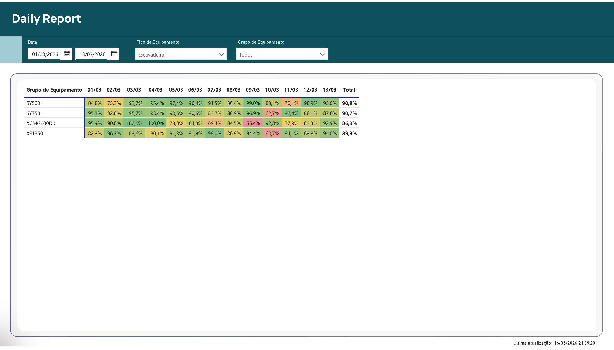
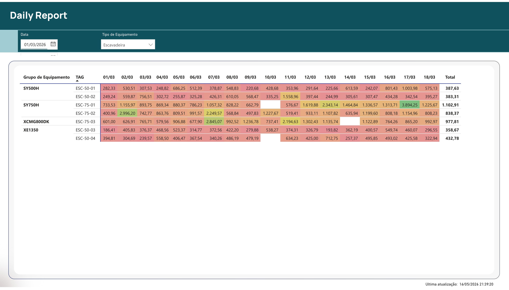

# Reporte Diário de Mina — Dashboard de Performance Operacional

Dashboard em **Power BI** que consolida indicadores diários de produção,
disponibilidade e utilização da frota de uma mina de ouro a céu aberto.
Inclui 9 páginas com cards de KPI, gráficos combo, waterfall (cascata) e tabelas dinâmicas.

> **Dados fictícios.** Este projeto reproduz a *estrutura analítica* de um
> dashboard real (modelo, medidas, layout dos visuais), mas todos os dados
> são sintéticos, sem qualquer relação com operações reais. Empresa de
> referência: "Mineradora Ouro Verde".

🎥 **Demo em vídeo (Loom):** [Assista aqui (Loom)](https://www.loom.com/share/82625cb547c84a139cf45f36543c1821)
📑 **Capturas:** [galeria abaixo](#galeria-de-telas) · 📄 [PDF do relatório](Reporte%20Diário%20de%20Mina%20-%20Portfolio.pdf)

---

## Galeria de telas

### 1. Reporte Diário — Visão geral
Tela principal de acompanhamento da operação. Mostra **movimentação total** (Minério,
Estéril, Retomada, Outras Movimentações), evolução diária da movimentação, e os 4
blocos de KPI por tipo de equipamento (**Perfuratrizes, Escavadeira 75t/80t,
Escavadeira 1350t, Caminhões XCMG**) com DF, UF e Produtividade Efetiva. O
**impactômetro de transporte** (waterfall à direita) decompõe o gap entre Planejado
e Realizado em HC, DF, UF e Produtividade.



#### Interação — Tooltip "Lavra por Tipo de Material"
Ao passar o mouse sobre o card de **Movimentação Total**, abre um tooltip
customizado com o detalhamento por tipo de material — **Minério**, **Estéril**
e **OM** (Outras Movimentações) — exibindo `Ton Real (tbs)` e diferença (%)
versus o planejado. Demonstra **storytelling no card**: o usuário enxerga o
agregado e, com um hover, abre o drill por material sem sair da página.



### 2. Perfuração Diária
Acompanhamento da operação de perfuração com **metros perfurados por dia**,
comparação D-5 (média móvel) e MTD (acumulado do mês), além dos KPIs da
**Perfuratriz DM45** (DF, UF, Produtividade em m/h) e do impactômetro de
transporte.



### 3. Análise Hora-a-Hora
Visão de granularidade horária permitindo selecionar o indicador desejado
(**Mov Total, Minério, Estéril, Outras Movimentações, Viagens, DMT, Fila de
Carregamento/Basculamento, Tempo de Ciclo**). Mostra os KPIs do dia
selecionado para cada tipo de equipamento.



### 4. Análise por Equipamento
Permite filtrar por equipamento individual para diagnóstico fino. Útil para
investigar por que um equipamento específico está abaixo da meta — mostra DF,
UF, Produtividade e a cascata Build Up só para aquela máquina.



### 5. Daily Report — Resumo (Real Daily × Plan Daily × MTD)
Tabela executiva consolidando **todos os indicadores operacionais do dia
versus o plano**, com Real Daily, Plan Daily, Diferença, Real MTD, Plan MTD,
Diferença MTD e Month Plan. Cobertura: carga média, DMT, tonelagem por tipo
de material, KPIs por equipamento.



### 6. Daily Report — Dia a Dia
Detalhamento dia-a-dia para um período selecionado. Mostra Real Daily × Plan
Daily de cada indicador para cada dia do mês, facilitando identificar dias
fora do esperado.



### 7. Disponibilidade — Escavadeiras
Heatmap de **DF (Disponibilidade Física) por escavadeira × dia**. Cores
quentes (vermelho/laranja) sinalizam dias críticos abaixo da meta; verde
indica desempenho saudável. Visão imediata de padrões de manutenção/quebra.



### 8. Utilização — Escavadeiras
Mesmo padrão de heatmap, agora para **UF (Utilização Física) por escavadeira
× dia**. Útil para diferenciar problema de disponibilidade (máquina parada
para manutenção) de problema de utilização (máquina disponível mas ociosa).



### 9. Produtividade por Equipamento (TAG)
Detalhe individual por **TAG** (identificador único do equipamento). Cada
linha mostra a produtividade diária de uma máquina específica — permite
ranking interno entre equipamentos do mesmo grupo (ex: comparar ESC-50-01
× ESC-50-02 entre si).



---

## Indicadores principais

| Indicador | Equipamento | Realizado | Planejado |
|---|---|---:|---:|
| **DF** — Disponibilidade Física | Frota | ~89% | 85% |
| **UF** — Utilização Física | Frota | ~93% | 78% |
| **Produtividade** | Caminhão FMX/AROCS (16 unid.) | ~250 t/h | 140 t/h |
| **Produtividade** | Caminhão XGA110 (5 unid.) | ~170 t/h | 160 t/h |
| **Produtividade** | Escavadeira 50t (SY500H, XE1350) | ~425 t/h | 950 t/h |
| **Produtividade** | Escavadeira 75/80t (SY750H, XCMG800DK) | ~1.030 t/h | 1.500-1.650 t/h |
| **Produtividade** | Perfuratriz DM45 (8 unid.) | ~22 m/h | 22 m/h |
| **Tonelagem movida** | Total da operação | ~6,0 Mt | 6,3 Mt |

Período coberto: **01/01/2026 a 30/04/2026** (120 dias).

---

## Arquitetura

```
.pbip (Power BI Project, formato projeto)
├── SemanticModel/        Modelo dimensional (TMDL)
│   ├── 30 tabelas        Fatos: dw_code_report, dw_transport_report, dw_perfuratriz_report
│   │                     Dimensões: DimCaminhao, DimEsc1..3, DimPerfuratriz, d_Calendario, Equipamentos
│   │                     Medidas-host: Medidas Realizado, Medidas Planejado, Medidas Dif,
│   │                                   Medidas Buil Up, Medidas D-1
│   ├── 410 medidas DAX   HC, HEF, HFF, HM, HI, HT, DF Geral, UF Geral, Produtividade,
│   │                     Plan/Real/Dif por equipamento, cascata Build Up
│   └── Power Query (M)   Importação do dataset Excel local (no original era ODBC SQL + SharePoint)
└── Report/
    └── 23 páginas        Diário, Hora-Hora, KPIs por equipamento, Cascata, Mapa GPS,
                          Build Up, Planejado vs Realizado, Indicadores Mensais
```

### Tabelas fato

| Tabela | Linhas | Conteúdo |
|---|---:|---|
| `dw_code_report` | ~34.500 | Apontamentos de tempo por equipamento (operação, manutenção, downtime, inativo) |
| `dw_transport_report` | ~85.700 | Viagens de caminhão com carga, origem, destino, escavadeira carregadora |
| `dw_perfuratriz_report` | ~110 | Apontamentos específicos de perfuração (metros, tempo de furo) |
| `KPIS_hora` | ~890 | KPIs agregados hora-a-hora |

### Modelo de dados

- **Schema em estrela** com tabela calendário (`d_Calendario`) central
- Tabelas fato relacionadas a `Equipamentos` pelo campo `equipment`
- Relacionamentos por `production_date` para todos os fatos diários
- Medidas DAX organizadas em tabelas-host (`Medidas Realizado`, `Medidas Planejado`, `Medidas Dif`)

---

## DAX — exemplos de medidas

```dax
HC Realizado =
    CALCULATE ( SUM ( dw_code_report[duration] ) )

HEF Realizado =
    CALCULATE (
        SUM ( dw_code_report[duration] ),
        dw_code_report[code_type] = "Operation",
        dw_code_report[code_group] = "Efetivo"
    )

DF Geral Realizado =
    DIVIDE ( [HD Realizado], [HC sem FF], 0 )

UF Geral Realizado =
    DIVIDE ( [HT Realizado], [HD Realizado], 0 )

Real Caminhao Produtividade =
    DIVIDE (
        CALCULATE (
            [Real Mov Total tbs],
            dw_transport_report[equipment_group] = "AROCS 4851k"
                || dw_transport_report[equipment_group] = "FMX 500 8X4"
        ),
        CALCULATE (
            [HT Realizado] / 60 / 60,
            dw_code_report[equipment_group] = "FMX 500 8X4"
                || dw_code_report[equipment_group] = "AROCS 4851k"
        ),
        BLANK ()
    )
```

(Total de **410 medidas** no projeto.)

---

## Como abrir localmente

1. Power BI Desktop (versão de 2024 ou mais recente).
2. Habilitar "Power BI Project (.pbip) save option" em **Opções → Preview features**.
3. Abrir `Reporte Diário de Mina - Portfolio.pbip`.
4. Quando pedir credenciais para o Excel local, escolher **Anônimo** → **Conectar**.
5. Clicar em **Atualizar**.

Detalhes em [`COMO_ABRIR.md`](COMO_ABRIR.md).

---

## Skills demonstrados

- **Power BI Desktop** (formato PBIP, TMDL, Power Query, DAX)
- **DAX avançado**: CALCULATE com filtros múltiplos, time intelligence, KPIs ratio
- **Modelagem dimensional** em ambiente operacional industrial
- **Power Query (M)** com integração de fontes heterogêneas (no original: SQL + SharePoint)
- **Design de relatórios** multi-página com bookmarks, drill-through, slicers cruzados
- **Domínio operacional** de mineração: ciclo de produção, indicadores DF/UF/Produtividade,
  códigos de tempo (Operation/Maintenance/Downtime/Inactive), Build Up de massa
- **Visualizações**: cards de KPI, gráficos combo (linha + coluna), waterfall (cascata),
  mapas Azure, pivot tables, slicers avançados

---

## Sobre os dados sintéticos

- **Período:** 01/01/2026 a 30/04/2026 (120 dias)
- **Produção média diária:** ~50.000 t/dia (~70 t/viagem × 714 viagens/dia)
- **Mix de material:** Minério 50% / Estéril 35% / Rehandle 15%
- **Frota:** 21 caminhões (FMX 500 8X4, AROCS 4851k, XGA110), 7 escavadeiras
  (SY500H, XE1350, SY750H, XCMG800DK), 8 perfuratrizes (DM45)
- **Valores categóricos** (equipment_group, code_type, code_group, movement_type) foram
  extraídos das próprias medidas DAX originais para garantir que os filtros calculem
  corretamente

---

## Estrutura do repositório

```
.
├── Reporte Diário de Mina - Portfolio.pbip
├── Reporte Diário de Mina - Portfolio.SemanticModel/
├── Reporte Diário de Mina - Portfolio.Report/
├── dados_ficticios.xlsx
├── COMO_ABRIR.md         Passo a passo de abertura no Power BI Desktop
├── README.md             Este arquivo
└── prints/               Screenshots do dashboard (9 telas + tooltip)
```

---

## Contato

**Késia Karine Santos**
- 📧 [kesiakarine0405@gmail.com](mailto:kesiakarine0405@gmail.com)
- 💼 [linkedin.com/in/kesia-karine-santos](https://www.linkedin.com/in/kesia-karine-santos)

Aberta a vagas em **Análise de Dados / BI / Engenharia de Dados** — principalmente
em operações industriais, mineração ou áreas correlatas.
